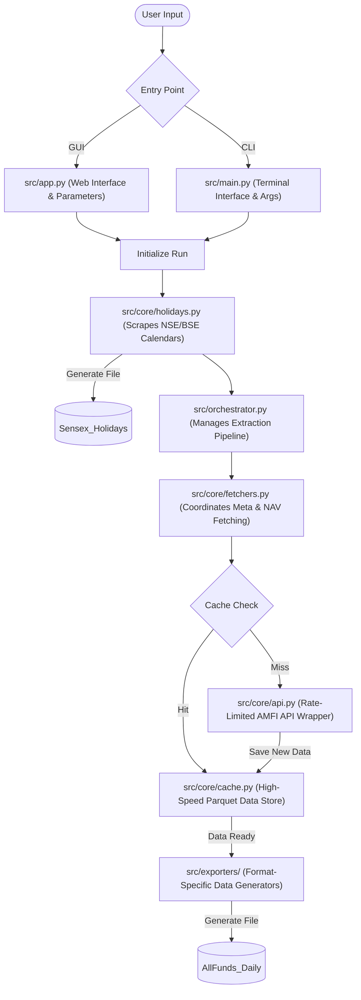

# Indian Mutual Fund Tracker

A highly optimized Python-based toolkit for tracking Indian mutual fund NAV data and stock market holidays. Uses a robust `fastparquet` caching engine to handle millions of historical NAV records, allowing you to instantly export data to Tableau Hyper, CSV, Parquet, or SQLite formats.

---

## Project Structure

```
indian-mutual-fund-tracker/
├── src/
│   ├── app.py                         # Streamlit GUI entry point
│   ├── main.py                        # Primary CLI entry point
│   ├── orchestrator.py                # Mutual fund data pipeline orchestrator
│   ├── core/                          # API, Caching, Fetchers, and Holidays logic
│   └── exporters/                     # Modular export engines (Hyper, CSV, etc.)
├── data/                              # Auto-generated cache files (gitignored)
│   ├── nav_data_cache.parquet         # High-speed historical NAV cache
│   ├── scheme_metadata_cache.parquet  # High-speed fund metadata cache
│   ├── indian_stock_holidays.pkl      # Holiday cache
│   └── cache_metadata.json            # Cache freshness tracker
├── output/                            # Generated final datasets (gitignored)
├── .venv/                             # Local virtual environment (gitignored)
├── requirements.txt
└── .gitignore
```

---

## Setup

```bash
# 1. Create and activate the virtual environment
python3 -m venv .venv
source .venv/bin/activate   # Windows: .venv\Scripts\activate

# 2. Install dependencies
pip install -r requirements.txt
```

---

## Running

### Launching the Graphical User Interface (GUI)

The easiest way to use the tracker is via the interactive web UI:

```bash
python src/main.py
# (Or manually: python -m streamlit run src/app.py)
```

### Command Line Interface (CLI)

Use the `src/main.py` entry point to trigger the optimized mutual fund extractor. It natively tracks progress using `tqdm` and leverages a 15-day freshness window on the Parquet cache to skip redundant API calls.

```bash
# Export as Tableau Hyper (default)
python src/main.py

# Export as CSV and Parquet starting from 2020
python src/main.py --format csv parquet --start-date 2020-01-01
```

**Available Arguments:**
- `--start-date`: Start date (YYYY-MM-DD). Defaults to Jan 1st of the current year.
- `--end-date`: End date (YYYY-MM-DD). Defaults to today.
- `--format`: Desired output format(s). Valid options: `hyper`, `csv`, `parquet`, `sqlite`.
- `--workers`: Number of parallel API threads (default: 30).

## System Flowchart

Here is a visual representation of how execution flows through the codebase when an extraction is triggered:



---

## Dependencies

| Package | Purpose |
|---|---|
| `mftool` | AMFI NAV data |
| `fastparquet` | Lightning-fast cache I/O |
| `tableauhyperapi` | Tableau Hyper file export |
| `pandas` | Core data processing |
| `tqdm` | Native terminal progress bars |
| `exchange-calendars` | NSE/BSE trading calendar (XBOM) |
| `requests` | HTTP calls to NSE live API |

---

## Cache Behaviour

The system uses a highly optimized, accumulative Parquet caching architecture in the `data/` directory.

- **Speed:** Caching allows repeated executions to drop from ~30 minutes down to just a few seconds.
- **Freshness:** The pipeline automatically tracks cache staleness via `cache_metadata.json` and skips the AMFI API entirely if data was fetched in the last 15 days.
- **Persistence:** Historical NAV values never change. The cache acts as an append-only time series and does not require manual invalidation.
